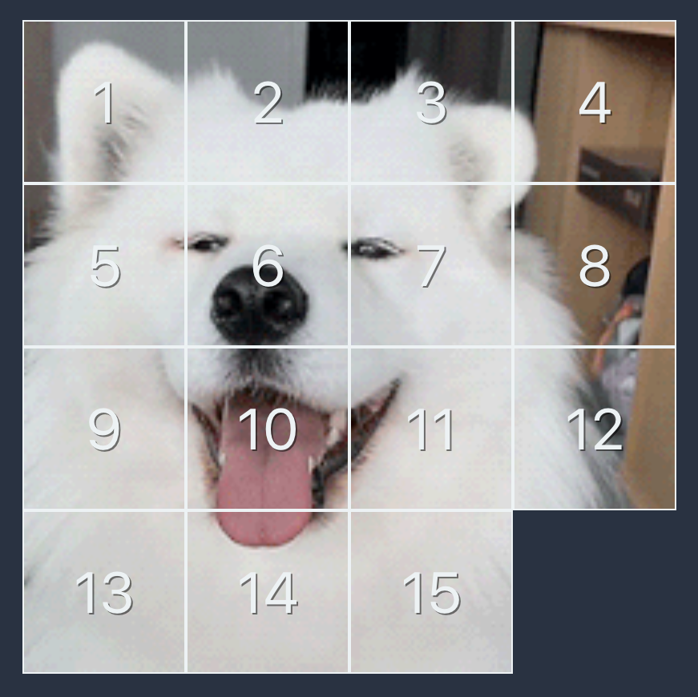

## 15-Puzzle Solver

Inspired by and modeled after the [8-puzzle assignment](https://www.coursera.org/learn/algorithms-part1/programming/iqOQi/8-puzzle) from the (free!) Princeton [Algorithms Coursera course](https://www.coursera.org/learn/algorithms-part1). This is an exercise in implementing the concepts, and adding some goofy backgrounds. :)

A 3x3 or 4x4 slider puzzle can be shuffled and solved. The solver can be paused any time by hitting "Stop" during playback. You can also just play the game normally.

The solver uses the A\* algorithm to explore possible moves. It uses [manhattan distance plus linear conflicts](https://algorithmsinsight.wordpress.com/graph-theory-2/a-star-in-general/implementing-a-star-to-solve-n-puzzle/) to prioritize moves. Note this implementation is not efficient enough for 5x5 boards.

The shuffler uses the Fisher-Yates shuffle to permute the tiles, then checks whether the board is solvable by [counting the number of inversions](https://www.geeksforgeeks.org/check-instance-15-puzzle-solvable/) (using mergesort). If the generated board is not solvable, it swaps two adjacent non-zero tiles to place it in the solvable equivalence class.

### Attribution

- [Create React App](https://github.com/facebook/create-react-app) bootstrap app
- [TinyQueue](https://github.com/mourner/tinyqueue) priority queue implementation
- [Giphy SDK](https://developers.giphy.com/docs/sdk/#web)
- [Flickr API](https://www.flickr.com/services/api/)
- [Font Awesome](https://fontawesome.com/license) icons
- [Open Game Art](https://opengameart.org/content/ui-soundpack-by-m1chiboi-bleeps-and-clicks) sound effect

### Development

- `yarn start`
- Open [http://localhost:3000](http://localhost:3000)

### Production

- `yarn run build`
- `yarn run deploy`
